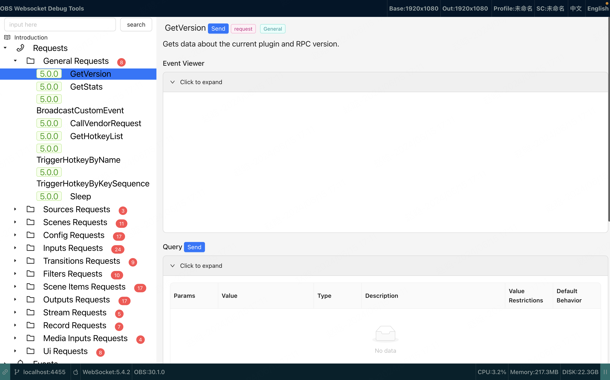
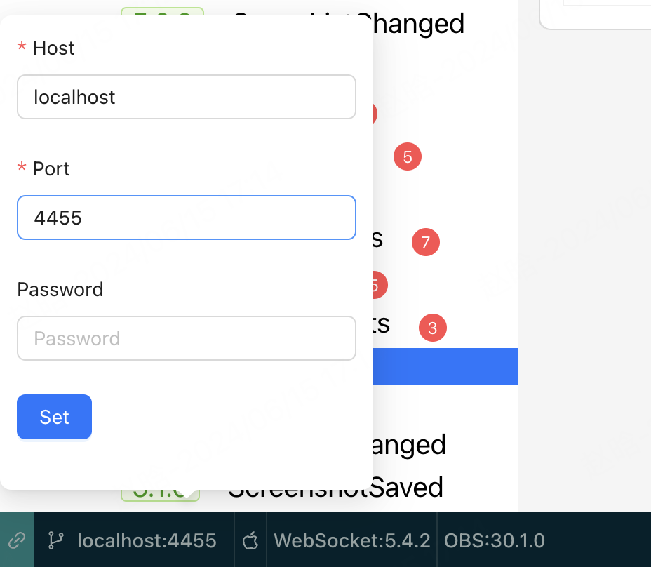
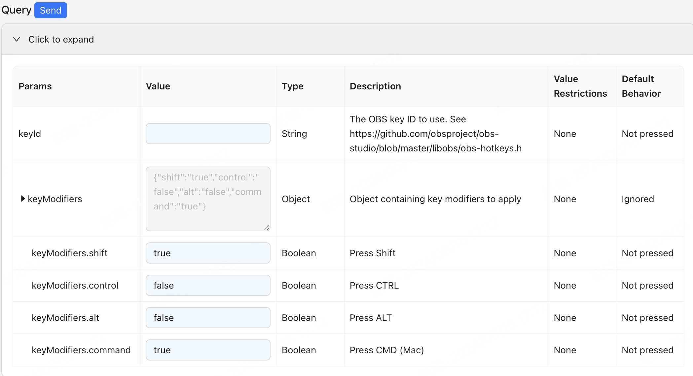
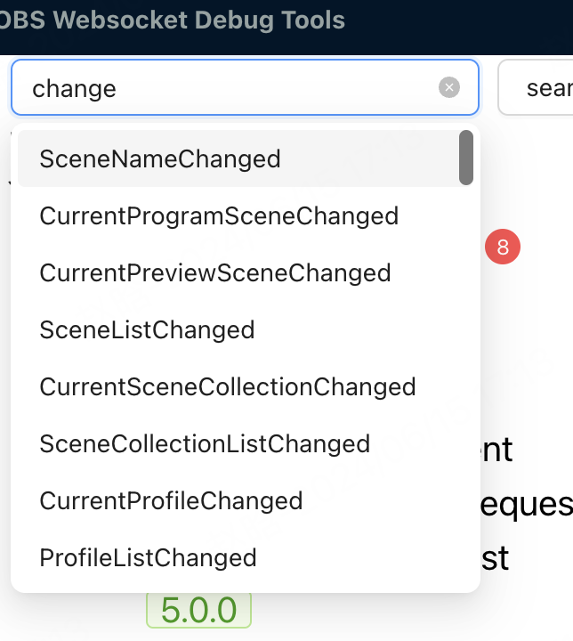
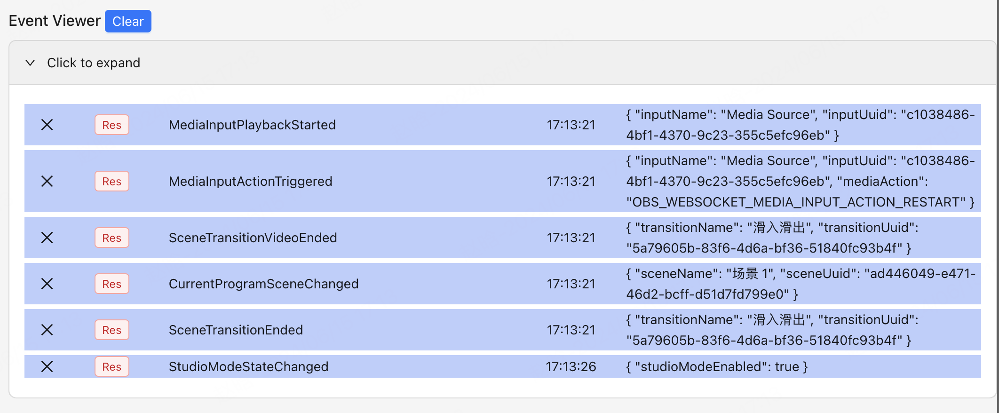
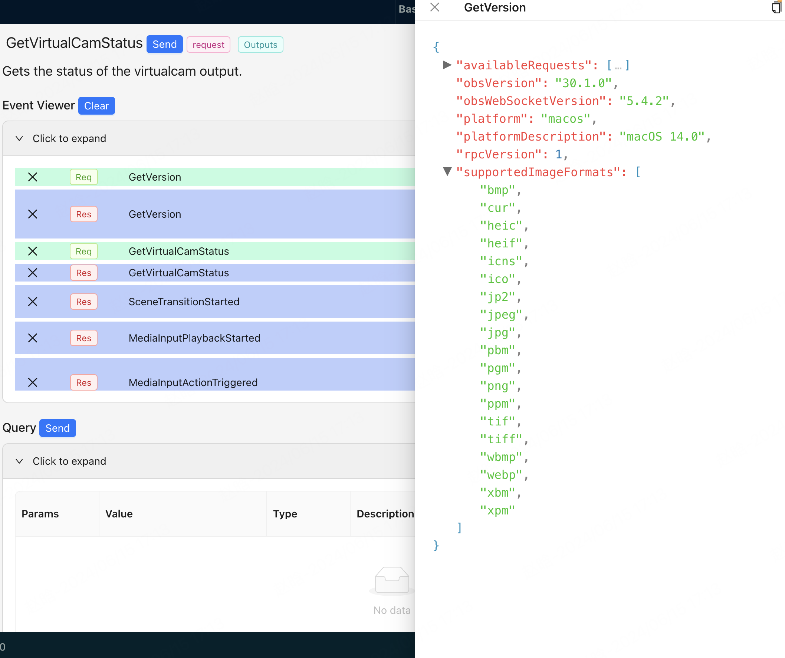

#### [查看中文文档](./README_CN.md)

### OBS WebSocket Debug Tool

This tool is a simple web page that allows you to connect to an OBS WebSocket server and send and receive messages. It is useful for debugging and testing your OBS Tools.

You can also use this page to check the document of OBS WebSocket API.

### Background

Basic On the [OBS WebSocket](https://github.com/obsproject/obs-websocket) API: [Protocol.md](https://github.com/obsproject/obs-websocket/blob/master/docs/generated/protocol.md)

### Usage

URL:[https://kirahan.github.io/obs_websocket_toolbox](https://kirahan.github.io/obs_websocket_toolbox)

### Screenshots

Main Page

Connect OBS WebSocket

Send OBS WebSocket Request

Search Requests Or Events

Events Viewer

Preview JSON Data

### Features

- [x] Check the document
- [x] Connect to an OBS WebSocket server
- [x] Send and receive messages
- [x] Support OBS above 26.0.0
- [x] Support OBS WebSocket above 4.9.0

### Build instructions:

1. Clone the repository
2. Run `npm install`
3. Run `npm run dev`

### ToDo

- [ ] A Configurable UI Page Allows You To Control OBS
- [ ] Support Logical Operations that Allow You To Accomplish Scheduled Tasks

### License

MIT License

