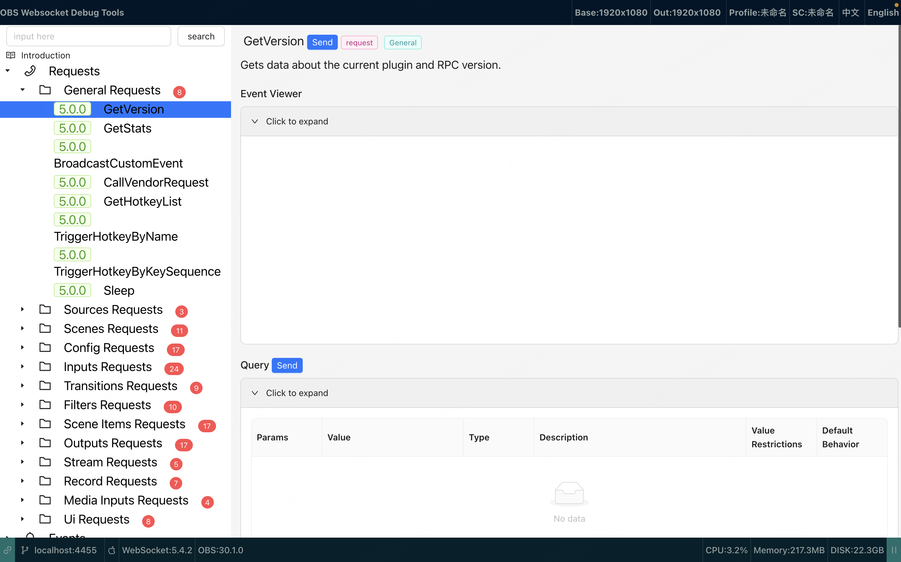
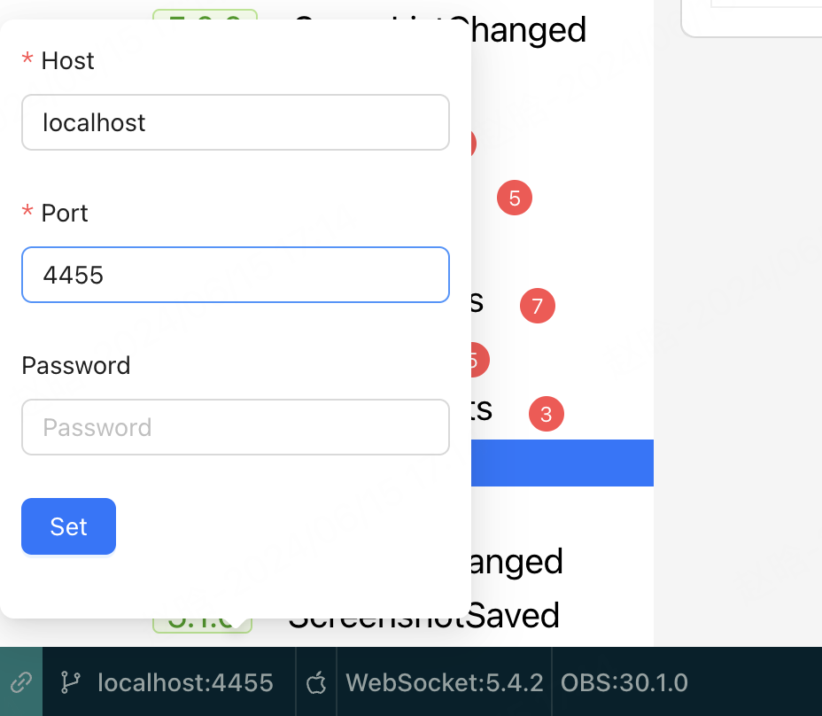
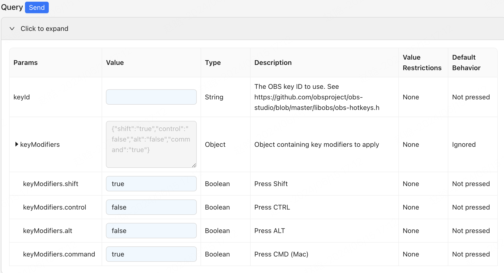
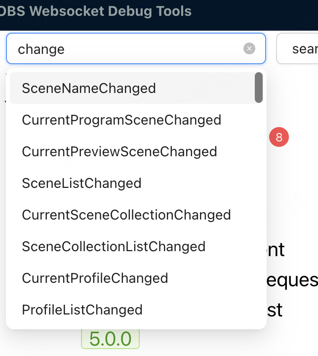
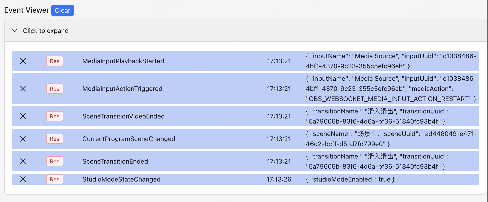
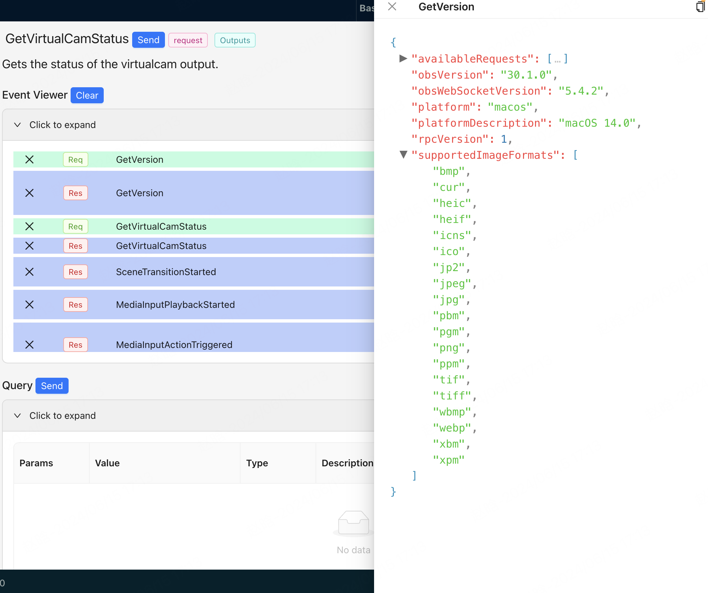

### OBS WebSocket Debug Tool

这个工具是一个简单的网页，允许你连接到一个OBS WebSocket服务器并发送和接收消息。它对调试和测试你的OBS工具非常有用。

### 背景

基于[OBS WebSocket](https://github.com/obsproject/obs-websocket) API: [Protocol.md](https://github.com/obsproject/obs-websocket/blob/master/docs/generated/protocol.md)


### 使用

URL:[https://kirahan.github.io/obs_websocket_toolbox](https://kirahan.github.io/obs_websocket_toolbox)

### 截图

主页面


连接OBS WebSocket


发送请求


搜索请求或事件


事件查看器


预览JSON数据


### 特点

- [x] 查看文档
- [x] 连接到OBS WebSocket服务器
- [x] 发送和接收消息
- [x] 支持OBS 26.0.0以上
- [x] 支持OBS WebSocket 4.9.0以上


### 构建说明:

1. 克隆仓库
2. Run `yarn install`
3. Run `yarn dev`

### 同步 OBS 协议文档

协议数据从 obs-websocket 官方文档自动生成，无需手动维护：

```bash
yarn sync-protocol
```

脚本会从 [protocol.md](https://github.com/obsproject/obs-websocket/blob/master/docs/generated/protocol.md) 拉取最新内容，更新：

- `src/data/generated/protocol.json` — 结构化协议数据
- `src/locales/en/debug.json` — 英文描述（全量替换协议相关字段）
- `src/locales/zh/debug.json` / `tw/debug.json` — 保留已有中文翻译，仅补充新增条目

也可使用本地文件调试：

```bash
node scripts/sync-protocol.mjs --local path/to/protocol.md
```

GitHub Actions 会每周一自动运行同步脚本，如有变更则创建 Pull Request（工作流：`Sync OBS WebSocket Protocol`）。也可在 Actions 页面手动触发。


### 待办事项

- [ ] 一个可配置的UI页面，允许您控制OBS
- [ ] 支持逻辑操作，允许您完成一些定时任务

### 许可证

MIT License