# OBS Websocket 工具集

**[English](./README.md)**

面向 OBS WebSocket 的模块化工具集 — 调试、导播、监听与集成。

在线体验：**[https://kirahan.github.io/obs_websocket_toolbox](https://kirahan.github.io/obs_websocket_toolbox)**

基于官方 [obs-websocket](https://github.com/obsproject/obs-websocket) 协议（[Protocol.md](https://github.com/obsproject/obs-websocket/blob/master/docs/generated/protocol.md)），支持 OBS 28+ 与 obs-websocket 5.x。

---

## 概览

OBS Websocket 工具集是一套运行在浏览器中的 OBS WebSocket 工具箱。相比早期的单一调试页，现已拆分为**多个独立模块**，覆盖协议探索、导播控制、事件监听、截图导出等不同场景。

**全局能力**

| 能力 | 说明 |
|------|------|
| **命令面板**（`⌘K` / `Ctrl+K`） | 任意页面搜索 Request、Event、预设或连接配置 |
| **协议文档侧边栏** | iframe 嵌入 API 文档，无需跳转 Debugger 即可查阅 |
| **底栏连接条** | 统一的 OBS 连接、版本与资源信息 |
| **多语言** | 简体中文、繁体中文、English |
| **协议同步** | 从 obs-websocket 官方文档自动同步 Request/Event 定义 |

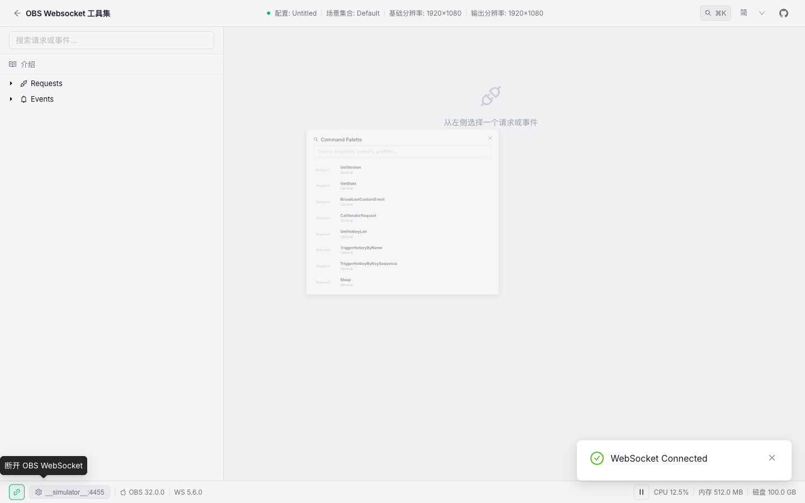

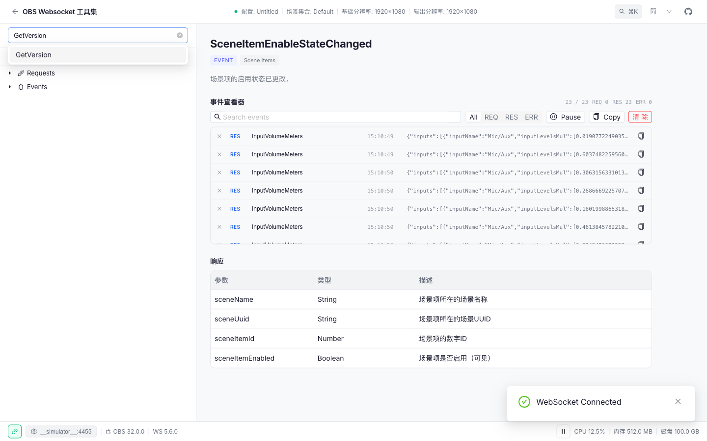

> 截图按模块存放在 [`screenshots/`](./screenshots/) 子目录，索引见 [`screenshots/README.md`](./screenshots/README.md)。

---

## 已上线模块

### 调试器（Debugger）

项目最初的核心模块 — 连接 OBS（或内置模拟器），浏览完整协议树，发送请求，查看响应与实时事件。

**主要功能**

- 协议树浏览与搜索（Requests + Events）
- 请求表单、Payload 预览、预设与 Diff 对比
- 实时 Event 查看器（过滤、暂停、JSON 树/原始视图）
- 连接配置与事件订阅

| | |
|---|---|
| 路由 | `/debug` |

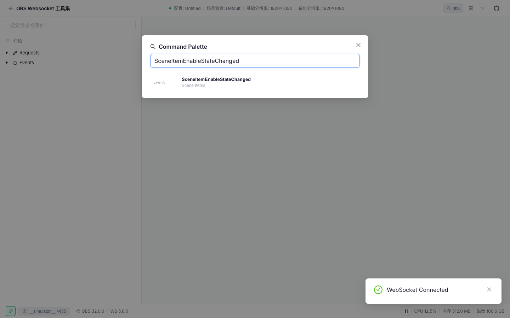

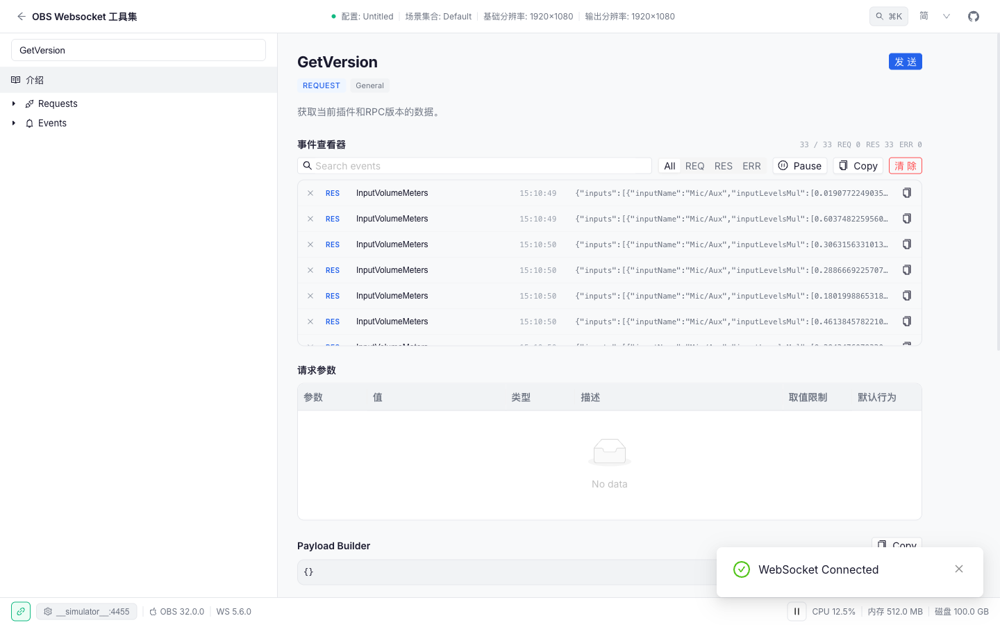

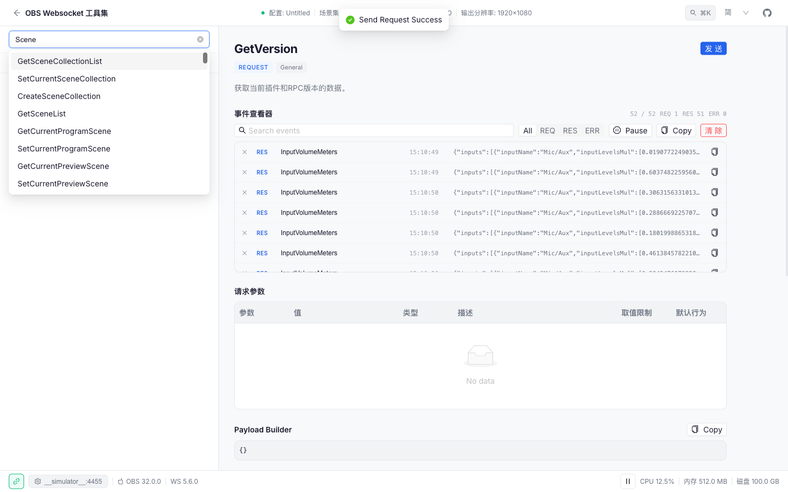

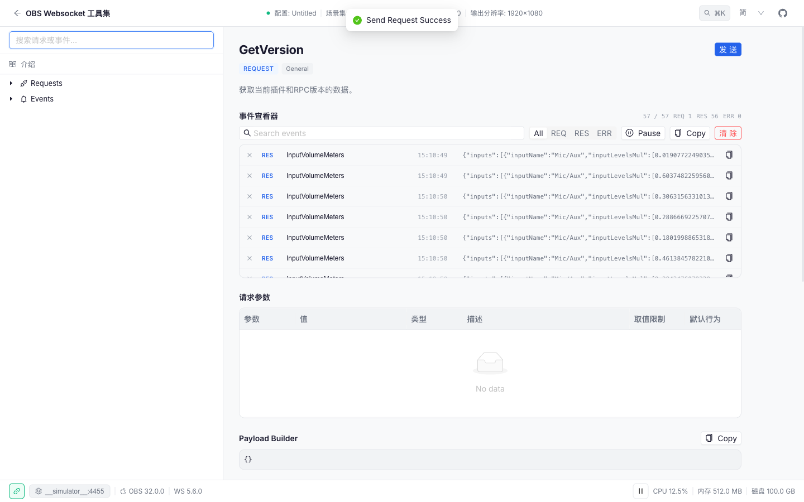

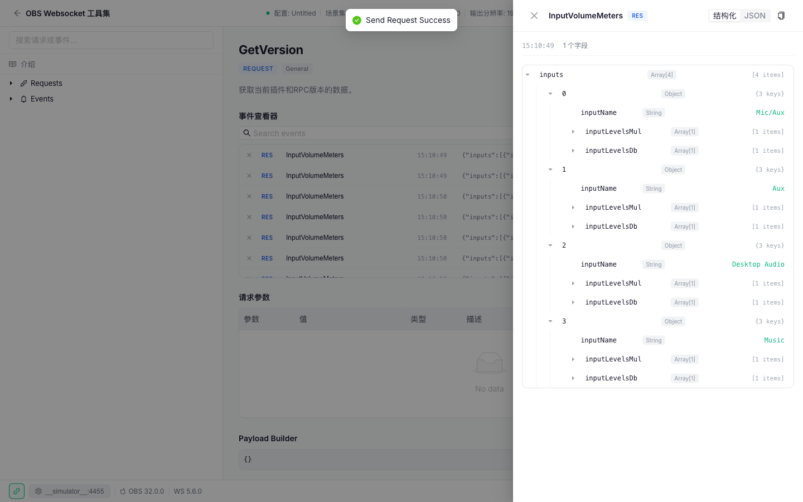

---

### 控制器 3.0（Controller）

整合导播控制台，将场景预览、PVW/PGM 监视器、转场、场景结构树与音频混音集中在一屏，支持上下/三栏拖拽分栏。

**主要功能**

- PVW / PGM 双监视器，定时场景截图（自动识别 Studio Mode）
- 转场条：类型、时长、T-Bar、Transition、Cut
- 场景栏：缩略图、PROGRAM/PREVIEW 徽章、刷新与批量导出
- 场景树：显隐/锁定、滤镜详情
- 紧凑音频通道：音量、静音、电平表
- 顶栏：录制、推流、Studio Mode、虚拟摄像头

| | |
|---|---|
| 路由 | `/controller` |

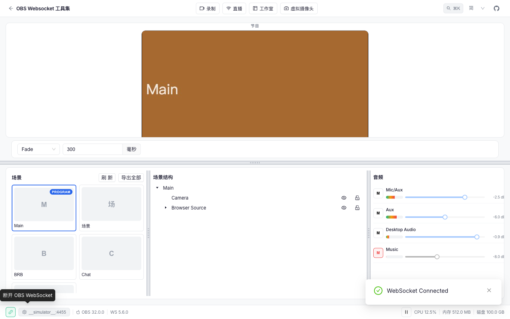

---

### OBS 模拟器（Simulator）

在浏览器内运行 obs-websocket 5.x 模拟服务端，无需安装 OBS 即可开发与联调。

**主要功能**

- 启动/停止内存 WebSocket 模拟器
- 可编辑模拟状态（场景、推流、录制、Studio Mode 等）
- 按 Request 类型自定义响应
- 手动广播 Event（JSON 载荷）
- 一键启动模拟器并连接 Debugger

| | |
|---|---|
| 路由 | `/simulator` |

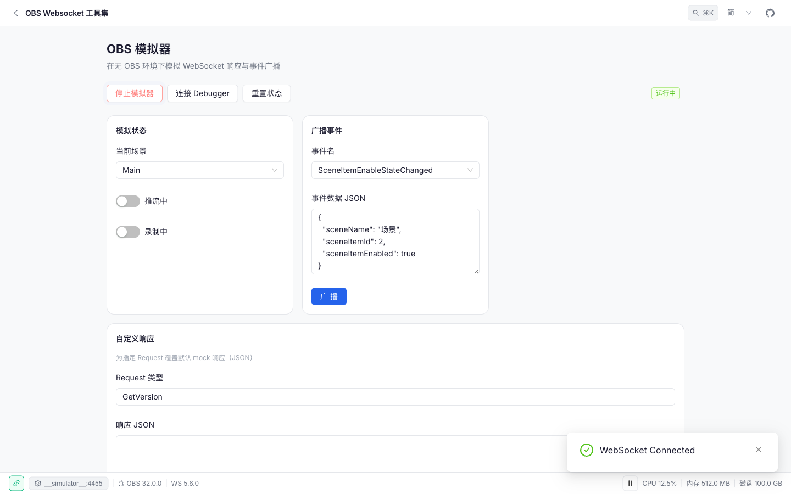

---

### 批处理执行器（Batch Runner）

可视化编排并执行多个 WebSocket 请求，适合多步操作与测试 Batch 专用 Request（如 `Sleep`）。

**主要功能**

- 步骤列表：选择 Request、编辑 JSON、排序与删除
- 串行 / 并行执行
- 单步延迟与执行日志
- 导入 / 导出 Batch JSON

| | |
|---|---|
| 路由 | `/batch-runner` |

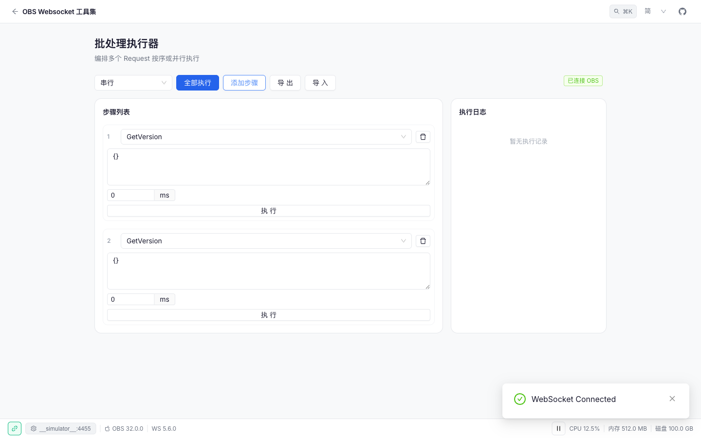

---

### 事件监视器（Event Monitor）

专职 OBS 事件与请求/响应时间轴，比 Debugger 内嵌 EventViewer 更适合长时间监听。

**主要功能**

- 时间轴：时间、类型、名称、**摘要（Summary）** 与 **原始 Payload**
- 按关键词、事件分类过滤；可选显示 Request/Response
- 暂停 / 继续采集、清空会话
- 导出 JSON / CSV；点击事件名打开协议文档侧边栏
- 抽屉内 JSON 树查看完整载荷

| | |
|---|---|
| 路由 | `/event-monitor` |

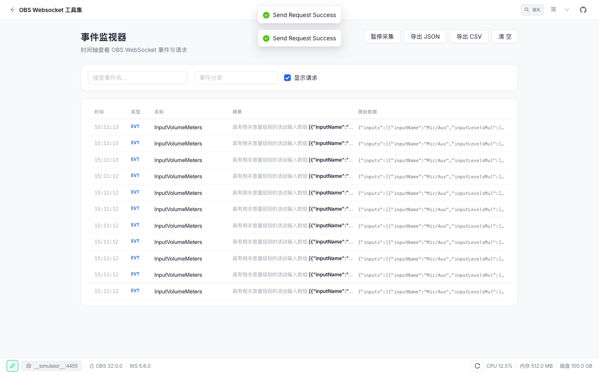

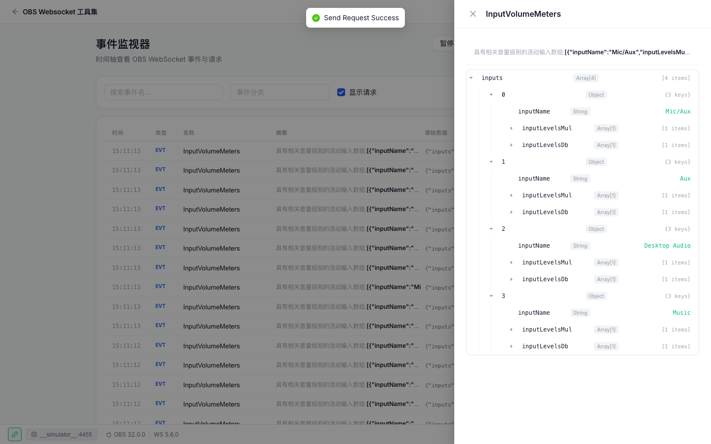

---

### 代码生成器（Code Generator）

根据选定的 Request 与 JSON 参数生成客户端调用代码，调试通过后无需手抄。

**主要功能**

- 选择任意 Request，编辑参数 JSON
- 输出 JavaScript（obs-websocket-js）、Python、curl、原始 JSON
- Event 订阅示例代码
- 一键复制

| | |
|---|---|
| 路由 | `/code-generator` |

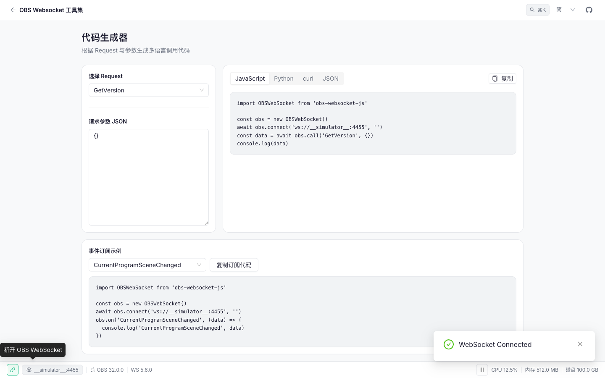

---

### Vendor 探索器（Vendor Explorer）

探索与测试第三方插件通过 `CallVendorRequest` 暴露的 **Vendor Request / Vendor Event**。

**主要功能**

- Vendor 列表及已知 Request/Event 类型
- 发送 Vendor 请求并查看响应
- Vendor 事件日志

| | |
|---|---|
| 路由 | `/vendor-explorer` |

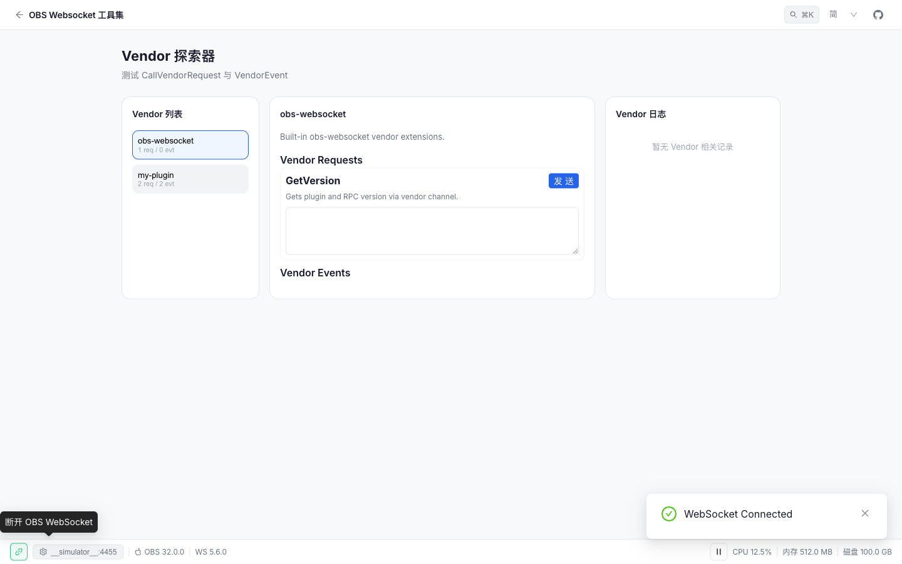

---

### 截图工作室（Screenshot Studio）

围绕 `GetSourceScreenshot` / `SaveSourceScreenshot` 的专用工具 — 预览、调参、导出。

**主要功能**

- 选择场景或输入源
- 宽/高、原始尺寸、格式、JPEG 质量
- 截取预览、下载、复制到剪贴板
- 保存到 OBS 可访问路径
- 批量导出所有场景截图

| | |
|---|---|
| 路由 | `/screenshot-studio` |

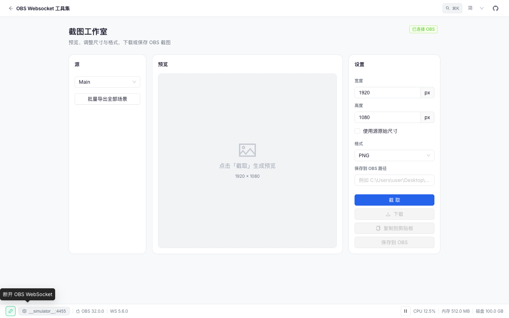

---

## 规划中的模块

首页以 **开发中** 展示（见 [首页 — 规划中模块](./screenshots/home/planned-modules.png)）。详细说明见 [`docs/modules/`](./docs/modules/)，UI 效果图：

| 模块 | 说明 | 效果图 |
|------|------|--------|
| **自定义按钮面板** | 可配置按钮网格，绑定 WebSocket 操作 |  |
| **自动化编排** | 事件/定时触发 Request 序列 |  |
| **Webhook 桥接** | OBS 事件出站 HTTP，外部 Webhook 触发 OBS | 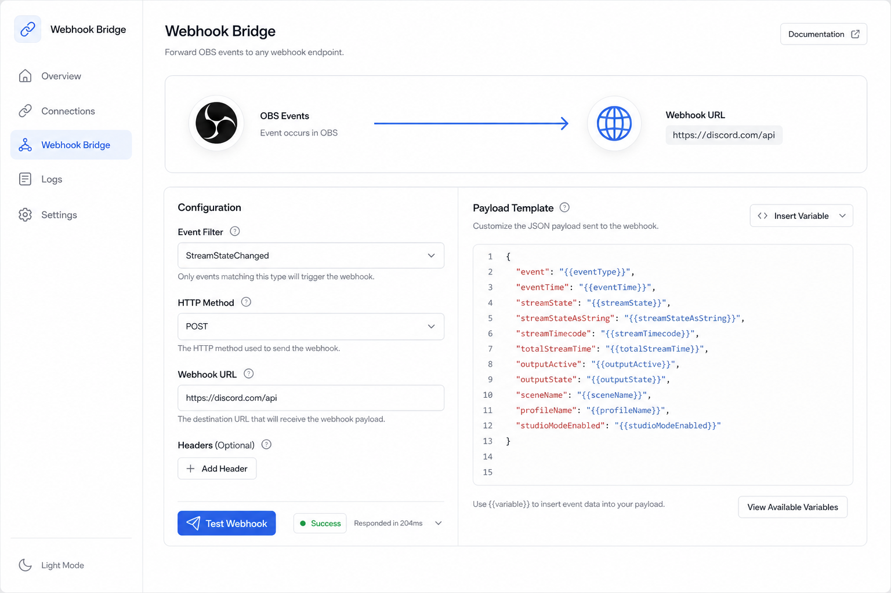 |
| **多实例管理** | 同时连接与遥控多台 OBS | 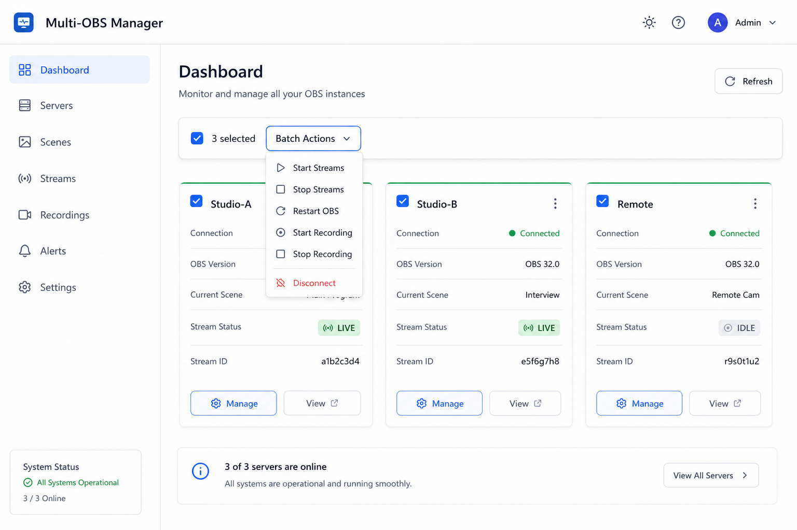 |

完整路线图：[docs/modules/README.md](./docs/modules/README.md)

---

## 快速开始

### 在线使用

打开 **[https://kirahan.github.io/obs_websocket_toolbox](https://kirahan.github.io/obs_websocket_toolbox)**，选择模块，在底栏连接 OBS（默认 `ws://localhost:4455`），或先启动 **模拟器**。

### 本地开发

```bash
git clone https://github.com/kirahan/obs_websocket_toolbox.git
cd obs_websocket_toolbox
yarn install
yarn dev
```

生产构建：

```bash
yarn build
```

运行测试：

```bash
yarn test
```

### 同步 OBS 协议文档

协议数据从 obs-websocket 官方文档自动生成：

```bash
yarn sync-protocol
```

会更新 `src/data/generated/protocol.json` 与各语言 locale 文件。GitHub Actions 每周一自动同步，也可在 Actions 页面手动触发。

使用本地 protocol 文件调试：

```bash
node scripts/sync-protocol.mjs --local path/to/protocol.md
```

---

## 技术栈

- Vue 3 + TypeScript + Vite
- Ant Design Vue
- [obs-websocket-js](https://github.com/obs-websocket-community-projects/obs-websocket-js) 5.x
- 部署于 GitHub Pages（`base: /obs_websocket_toolbox/`）

---

## 许可证

MIT License
