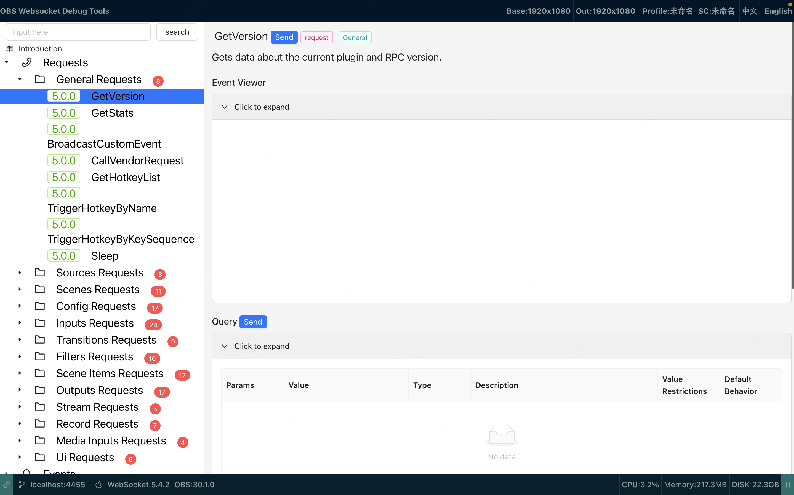
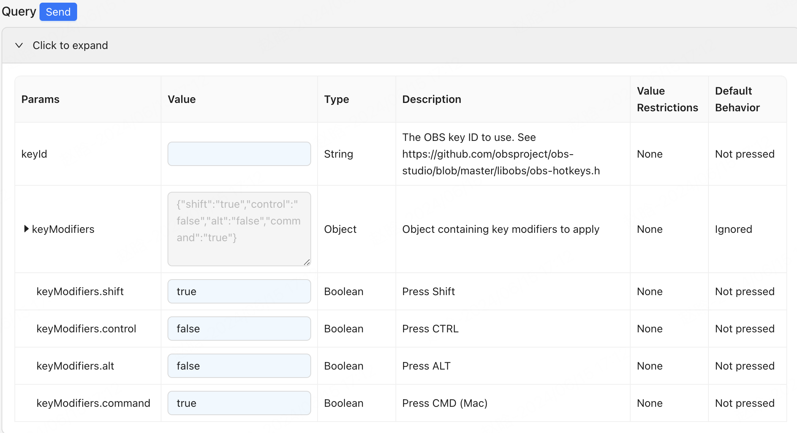
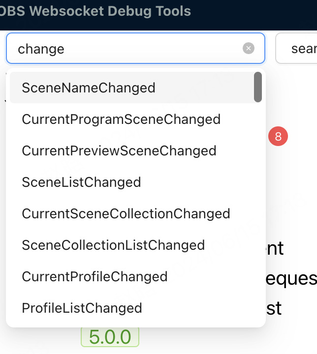

### OBS WebSocket Debug Tool

这个工具是一个简单的网页，允许你连接到一个OBS WebSocket服务器并发送和接收消息。它对调试和测试你的OBS工具非常有用。

### 背景

基于[OBS WebSocket](https://github.com/obsproject/obs-websocket) API: [Protocol.md](https://github.com/obsproject/obs-websocket/blob/master/docs/generated/protocol.md)

### 使用

URL:[https://kirahan.github.io/obs_websocket_toolbox](https://kirahan.github.io/obs_websocket_toolbox)

### 截图

主页面

连接OBS WebSocket

发送请求

搜索请求或事件

事件查看器

预览JSON数据

### 特点

- [x] 查看文档
- [x] 连接到OBS WebSocket服务器
- [x] 发送和接收消息
- [x] 支持OBS 26.0.0以上
- [x] 支持OBS WebSocket 4.9.0以上

### 构建说明:

1. 克隆仓库
2. Run `npm install`
3. Run `npm run dev`

### 待办事项

- [ ] 一个可配置的UI页面，允许您控制OBS
- [ ] 支持逻辑操作，允许您完成一些定时任务

### 许可证

MIT License