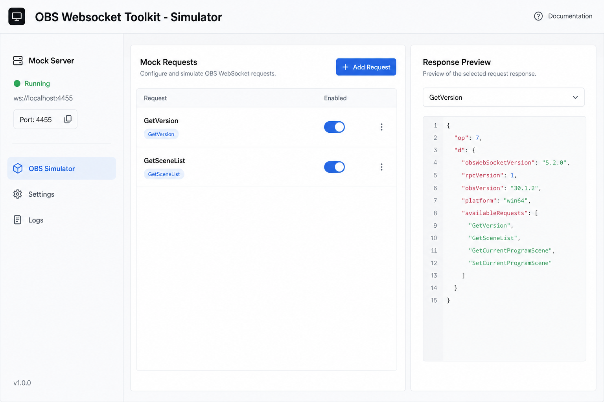

# OBS 模拟器 (Simulator)



## 一句话

在没有安装 OBS 的环境下，模拟 obs-websocket 5.x 服务端，供开发与测试使用。

## 解决什么问题

- 开发者没有 OBS 也能调试第三方工具
- CI 中跑集成测试
- 模拟错误响应（如 `ResourceNotFound`）
- 录制真实 OBS 会话并回放

## 核心功能

- [ ] WebSocket 服务端（Hello → Identify → Request/Response）
- [ ] 内置常用 Request 的 mock 响应（GetVersion、GetSceneList 等）
- [ ] 可编辑 mock 规则（JSON 配置）
- [ ] 手动触发 Event 广播
- [ ] 录制 / 回放模式
- [ ] 与 Debugger 一键连接（localhost 预设端口）

## 与现有模块关系

```
Simulator ←── Debugger / 第三方客户端
     │
     └── 替代真实 OBS，补齐工具链闭环
```

- **Debugger**：连接 Simulator 而非真 OBS
- **Controller**：可连 Simulator 做 UI 联调（mock 数据需足够丰富）

## 主要协议依赖

- OpCode 0–7：Hello、Identify、Request、RequestResponse、Event
- 常用 Requests：GetVersion、GetSceneList、GetStats、GetInputList 等

## 实现复杂度

**高** — 需实现 WS 服务端 + 状态机 + mock 引擎；可先 MVP 只支持 20 个常用 Request。

## 差异化

市面少见「浏览器内 OBS WS 模拟器 + 同站 Debugger」的一体化方案。

## 待决问题

- 跑在浏览器（Web Worker）还是需 Node 侧服务？
- mock 数据是否与 `protocol.json` 自动生成联动？
