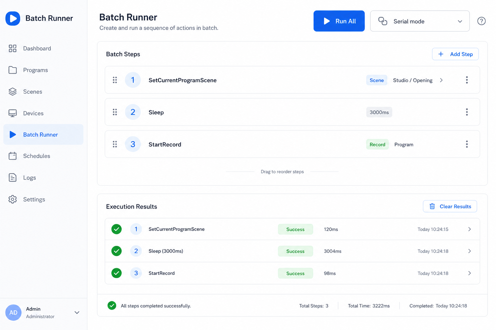

# 批处理执行器 (Batch Runner)

## 一句话

可视化编排并执行 obs-websocket 的 RequestBatch，支持串行、帧同步、并行等执行模式。

## 解决什么问题

- 一次操作需要多个 Request 按顺序执行（如：切场景 → 等 3 秒 → 开录）
- 调试 `Sleep` 等仅在 Batch 中可用的 Request
- 保存常用操作序列为「脚本」

## 核心功能

- [ ] 步骤列表：添加 Request、配置参数、调整顺序
- [ ] 执行模式选择：None / SerialRealtime / SerialFrame / Parallel
- [ ] 单步执行 / 全部执行
- [ ] 每步响应与耗时展示
- [ ] 导入 / 导出 JSON（类似 Postman Collection）
- [ ] 从 Debugger 当前 Request 一键加入 Batch

## 与现有模块关系

- **Debugger**：单 Request 调试；Batch Runner 管「多 Request 编排」
- **Automation**：Batch 是「手动触发的一次性脚本」；Automation 是「事件触发的持久规则」

## 主要协议依赖

- RequestBatch (OpCode 8) / RequestBatchResponse (OpCode 9)
- Sleep、SetCurrentProgramScene、StartStream 等常组合 Request

## 实现复杂度

**中** — UI 为步骤编辑器 + 执行器；协议层已有 `obs-websocket-js` 支持。

## 差异化

官方文档有 Batch 概念，但缺少好用的可视化编排工具。

## 待决问题

- 是否与 Automation 合并为同一模块的两个 Tab？
