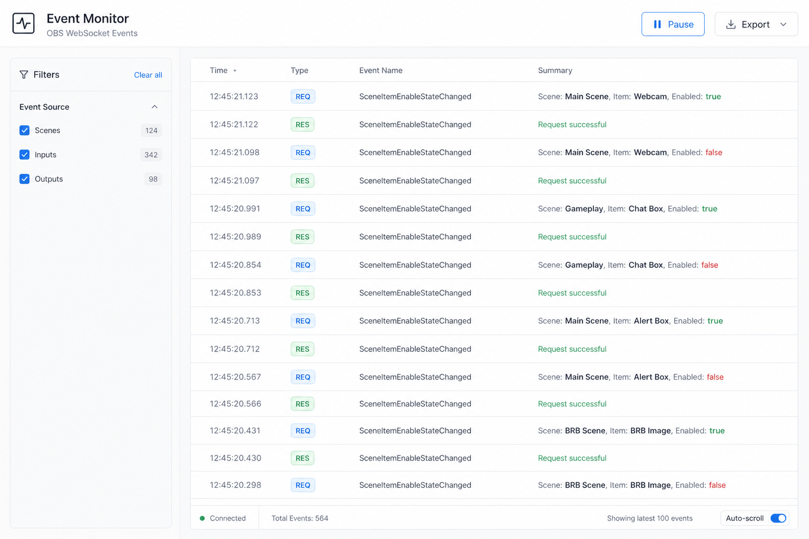

# 事件监视器 (Event Monitor)

## 一句话

专注「OBS 发生了什么」— 时间轴式事件流、过滤、分析与导出，从 Debugger 的 EventViewer 升级而来。

## 解决什么问题

- Debugger 里 EventViewer 混在请求详情中，不适合长时间监听
- 需要按类型过滤（Scenes / Inputs / Outputs）
- 需要分析事件频率、关联排查
- 需要导出 session 日志

## 核心功能

- [x] 全屏事件时间轴（时间 + 类型 + 名称 + 摘要 + 原始 Payload）
- [x] Summary 列：按协议字段解析参数，布尔值高亮，Request 显示成功/失败状态
- [ ] 按 Event 分类 / 名称过滤
- [ ] 高吞吐事件单独开关（InputVolumeMeters 等）
- [ ] 点击事件查看详情（结构化 + JSON）
- [ ] 暂停 / 继续采集
- [ ] 导出 JSON / CSV
- [ ] 从事件跳转到 Debugger 对应文档

## 与现有模块关系

- **Debugger**：发 Request + 临时看 Event；Event Monitor 是「专职监听站」
- 可从 Debugger EventViewer 拆出独立路由

## 主要协议依赖

- Event (OpCode 5)
- EventSubscription 位掩码配置（Reidentify）
- 全部 Events 分类（General / Scenes / Inputs / Outputs 等）

## 实现复杂度

**低–中** — 大量复用现有 `WSEventAndRequestHistory` 与 JsonViewer；主要是 UI 与过滤逻辑。

## 差异化

比原始 JSON 列表更专业的 OBS 事件分析界面。

## 待决问题

- 历史数据是否持久化（localStorage / IndexedDB）？
- 是否支持多 OBS 实例的事件合并视图（见 Multi-OBS）？
