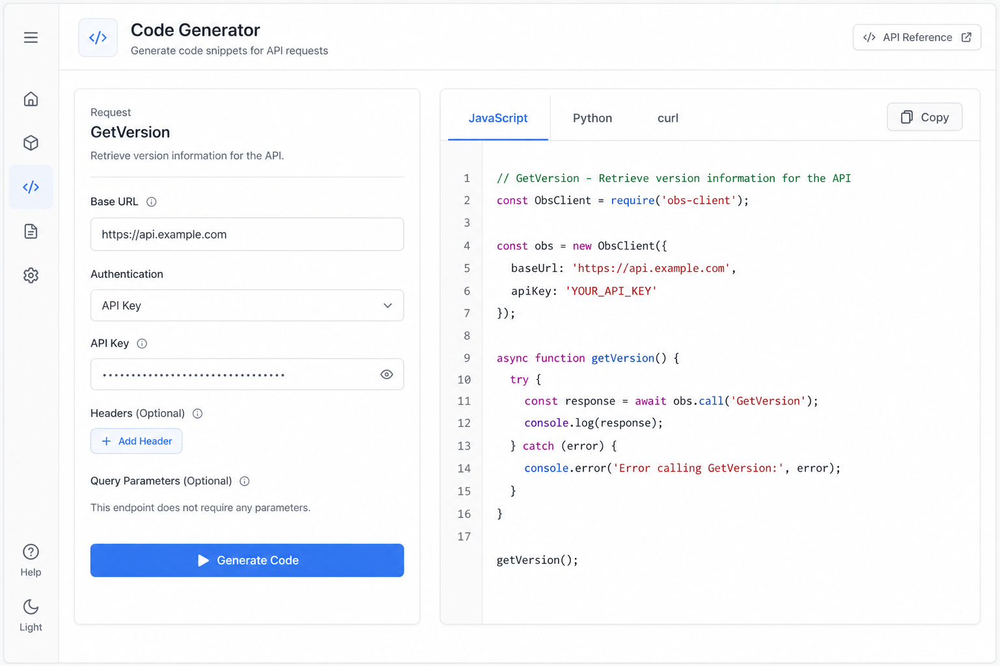

# 代码生成器 (Code Generator)

## 一句话

基于协议文档与当前填写的参数，一键生成 obs-websocket-js、Python、curl 等调用代码。

## 解决什么问题

- Debugger 调通 Request 后，还要手动抄代码到项目里
- 第三方开发者不熟悉 obs-websocket API 写法
- 减少 copy-paste 错误

## 核心功能

- [ ] 从 Debugger 当前 Request + 参数生成代码
- [ ] 支持语言：JavaScript (obs-websocket-js)、Python、curl、Raw JSON
- [ ] 连接配置嵌入（host / port / password 占位）
- [ ] 复制 / 下载 snippet
- [ ] Event 订阅示例代码生成

## 与现有模块关系

- **Debugger**：Detail 页增加「Generate Code」入口，或独立 Tab
- 依赖 `protocol.json` 与 `obsRequestDetailData`

## 主要协议依赖

- 任意 Request / Event 定义（纯文档层，无运行时依赖）

## 实现复杂度

**低** — 字符串模板 + 现有参数表单；可渐进增加语言。

## 差异化

Swagger UI 有类似能力；OBS 生态内专用 Code Gen 较少。

## 待决问题

- 作为 Debugger 子功能还是独立模块？
