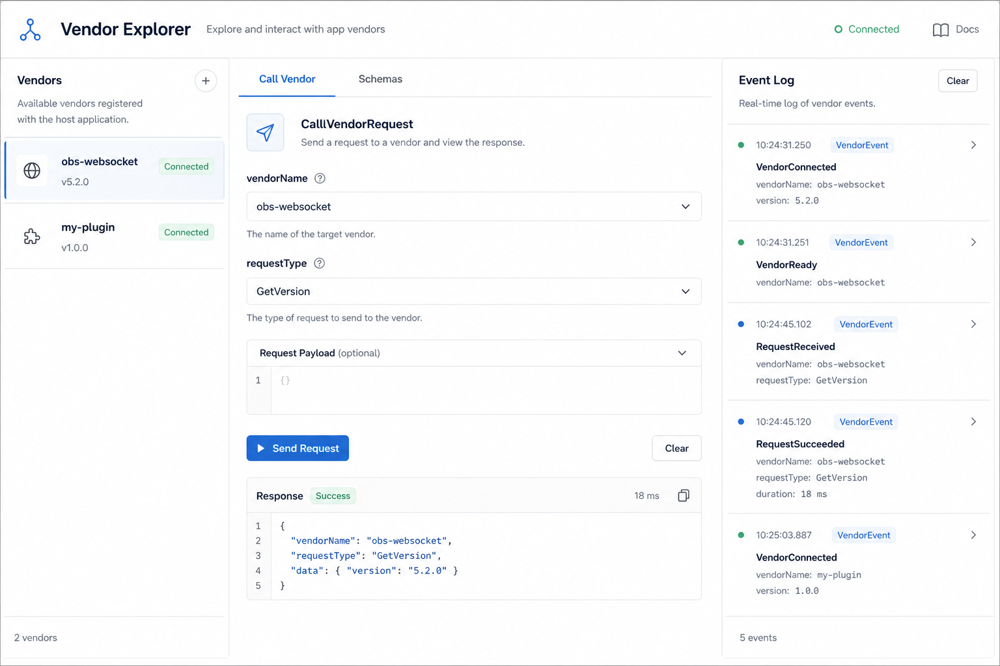

# Vendor 探索器 (Vendor Explorer)

## 一句话

探索与测试第三方插件注册的 Vendor Request / Vendor Event。

## 解决什么问题

- `CallVendorRequest` / `VendorEvent` 是扩展点，但无统一文档
- 插件开发者需要专用测试 UI
- 用户不知道已安装插件暴露了哪些 vendor API

## 核心功能

- [ ] Vendor 注册表（手动维护或从已知列表加载）
- [ ] 按 vendorName 浏览 requestType / eventType
- [ ] 发送 CallVendorRequest 并查看 responseData
- [ ] 监听 VendorEvent 并展示 eventData
- [ ] 自定义 vendor 文档 Markdown 展示

## 与现有模块关系

- **Debugger**：Vendor 请求已在 Requests 树中，但体验通用、无 vendor 维度组织
- **Event Monitor**：可过滤 VendorEvent

## 主要协议依赖

- CallVendorRequest、VendorEvent、BroadcastCustomEvent

## 实现复杂度

**中** — 协议简单，难点在 vendor 元数据从哪来（无官方 registry）

## 差异化

生态位独特，服务 OBS 插件/script 开发者。

## 待决问题

- 是否建立社区 vendor 文档仓库？
- 能否自动发现 vendor（OBS 无标准 API）？
