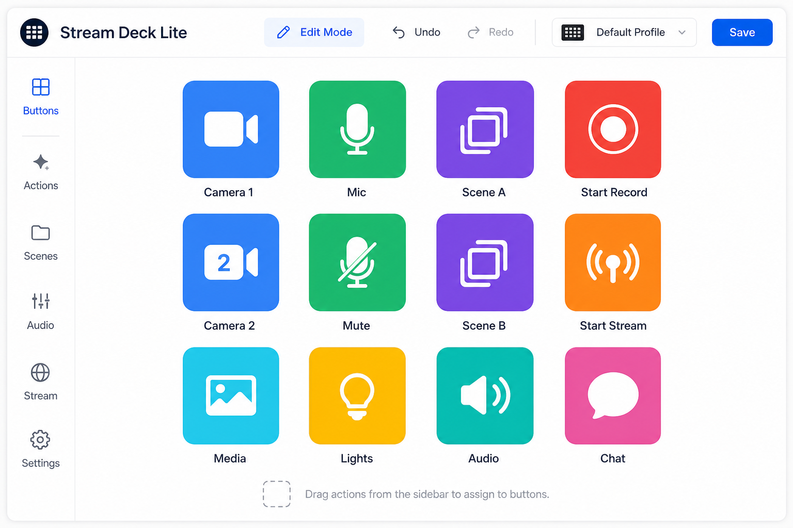

# 自定义按钮面板 (Stream Deck Lite)

## 一句话

用户自定义布局的 OBS 遥控面板 — 每个按钮绑定一个或多个 WebSocket 操作。

## 解决什么问题

- Controller 布局固定，无法按直播类型定制
- 手机 / Pad 远程导播需要大按钮、少层级
- Stream Deck 硬件贵，Web 版零成本

## 核心功能

- [ ] 网格布局编辑器（拖拽、改色、图标）
- [ ] 按钮动作：单个 Request / Request 序列 / 确认对话框
- [ ] 多页面 / 文件夹
- [ ] 配置导入 / 导出 JSON
- [ ] 全屏「导播模式」（隐藏编辑 UI）
- [ ] 手机响应式布局

## 与现有模块关系

- **Controller**：可视为「预设布局的简化版」；Stream Deck 是「用户可配置版」
- 长期可能：Controller 退役或变为 Stream Deck 的默认模板

## 主要协议依赖

- 任意常用 Requests：SetCurrentProgramScene、StartRecord、ToggleStream、SetInputMute 等

## 实现复杂度

**中–高** — 布局编辑器 + 动作引擎 + 持久化；MVP 可固定 3×4 网格 + 单 Request。

## 差异化

开源 Web 版 Stream Deck + 深度绑定 obs-websocket 语义。

## 待决问题

- 是否支持条件显示（如「仅在录制中显示 Stop」）？
- 与 Automation 的动作定义是否共用格式？
