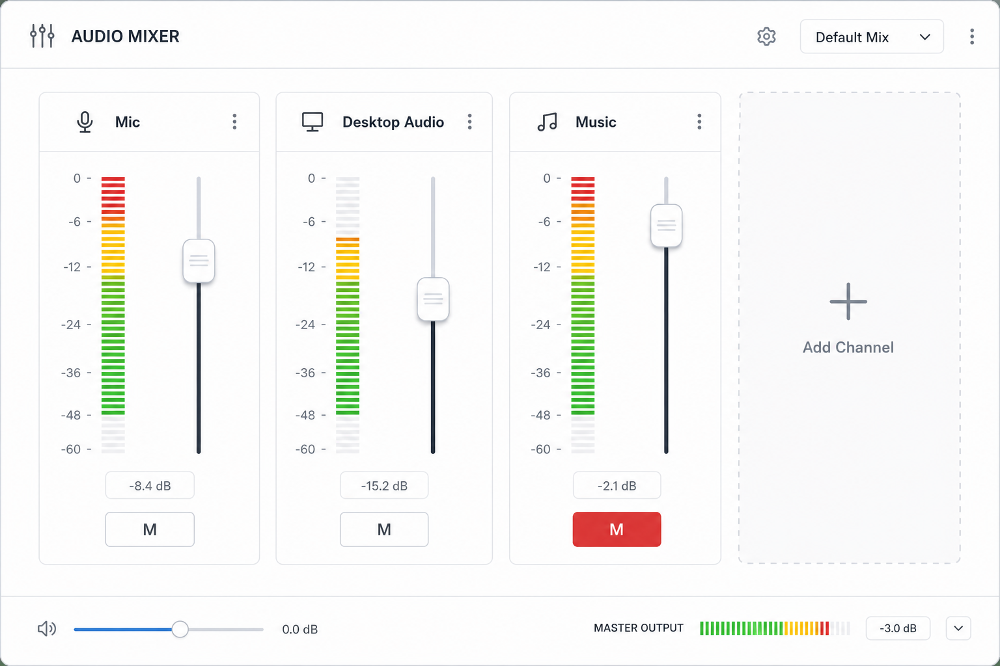

# 音频混音台 (Audio Mixer)

## 一句话

专业级音频控制界面 — 推子、静音、实时电平表，订阅高吞吐音量事件。

## 解决什么问题

- Controller 的 AudioItem 功能基础
- 导播需要一眼看所有音轨电平
- 快速 mute / 调 volume 是最高频操作之一

## 核心功能

- [ ] 多路推子（SetInputVolume）
- [ ] Mute / Unmute（ToggleInputMute）
- [ ] 实时 volume meter（InputVolumeMeters 事件）
- [ ] 音频平衡（SetInputAudioBalance）
- [ ] 监听类型指示（GetInputAudioMonitorType）
- [ ] 分组 mute（自定义分组，批量操作）

## 与现有模块关系

- **Controller**：Audio 区块的深化独立版
- **Event Monitor**：VolumeMeters 高吞吐事件需专门处理

## 主要协议依赖

- GetInputList、GetInputVolume、SetInputVolume、ToggleInputMute
- InputVolumeMeters、InputVolumeChanged、InputMuteStateChanged

## 实现复杂度

**中** — UI 为主；需处理 50ms 级 VolumeMeters 性能（节流渲染）。

## 差异化

比 Controller 音频区更「调音台」；比 Debugger 更「可操作」。

## 待决问题

- VolumeMeters 默认未订阅，需 Reidentify 开启 EventSubscription
- 是否支持仅显示当前场景相关音频源？
