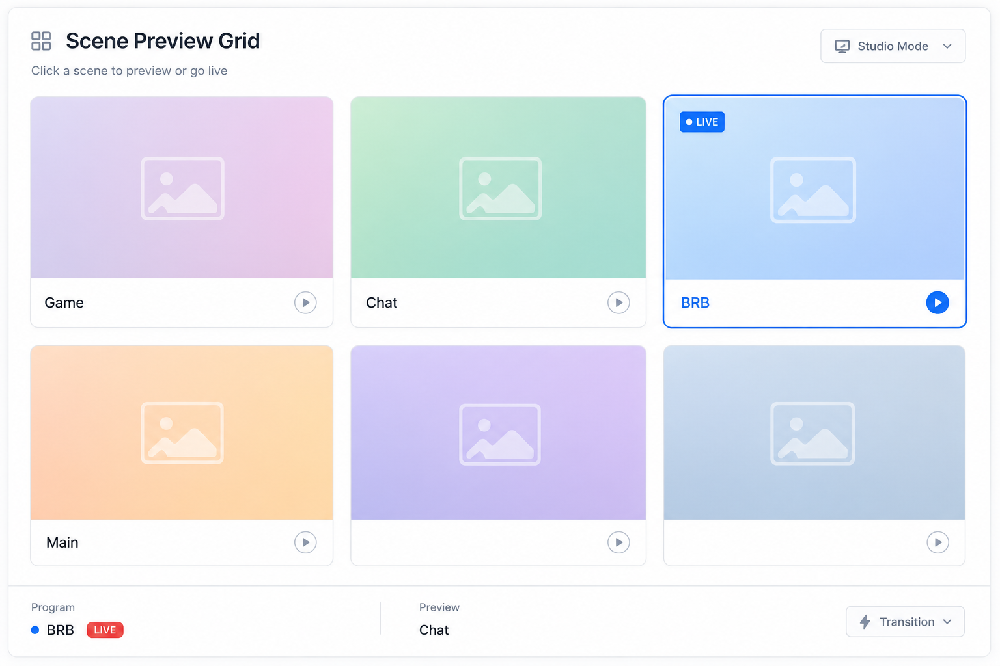

# 场景预览网格 (Scene Preview Grid)

## 一句话

网格展示所有场景缩略图，点击切换 Program / Preview 场景。

## 解决什么问题

- 场景名不够直观，导播需要「看到画面再切」
- Studio Mode 需区分 Program 与 Preview
- 多场景直播（游戏、聊天、BRB）切换易出错

## 核心功能

- [ ] GetSceneList + GetSourceScreenshot 定时拉缩略图
- [ ] 网格卡片：缩略图 + 场景名 + 当前标记
- [ ] 单击切 Program（SetCurrentProgramScene）
- [ ] Studio Mode：单击切 Preview，双击或按钮切到 Program
- [ ] 刷新间隔 / 分辨率配置
- [ ] 当前 Program / Preview 高亮

## 与现有模块关系

- **Controller**：Scene 区块的可视化升级版
- **Screenshot Studio**：共用 GetSourceScreenshot 能力

## 主要协议依赖

- GetSceneList、GetCurrentProgramScene、GetCurrentPreviewScene
- SetCurrentProgramScene、SetCurrentPreviewScene
- GetSourceScreenshot、GetStudioModeEnabled

## 实现复杂度

**中** — 截图 API 有频率与性能成本；需节流、缓存、懒加载。

## 差异化

OBS 自带预览在桌面端；Web 远程场景预览网格是明确需求点。

## 待决问题

- 截图间隔 vs OBS 负载权衡（建议 2–5s，可配置）
- 大场景列表时分页还是虚拟滚动？
