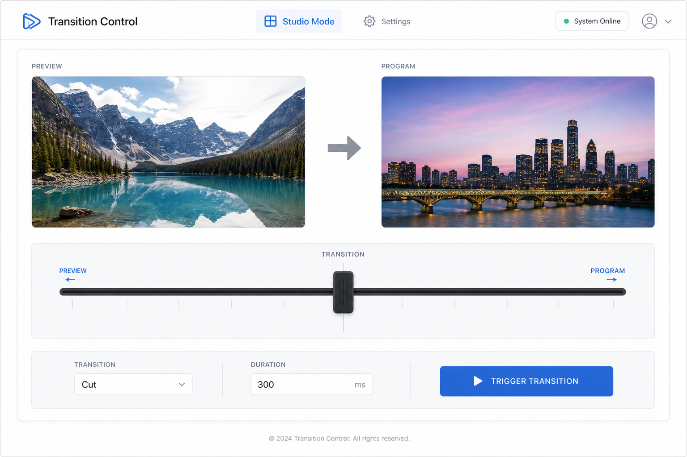

# 转场控制台 (Transition Control)

## 一句话

Studio Mode 转场的专业控制 — T-Bar、时长、类型、手动触发转场。

## 解决什么问题

- Controller 只有简单转场按钮
- Studio Mode 导播需要 T-Bar 手动控制转场进度
- 转场时长 / 类型调整是演播室常见需求

## 核心功能

- [ ] 当前转场名称与时长显示
- [ ] T-Bar 拖拽（SetTBarPosition）
- [ ] 触发转场（TriggerStudioModeTransition）
- [ ] 切换转场类型（SetCurrentSceneTransition）
- [ ] 调整时长（SetCurrentSceneTransitionDuration）
- [ ] Program / Preview 场景名对比显示
- [ ] 转场事件监听（SceneTransitionStarted / Ended）

## 与现有模块关系

- **Controller**：Transition 区块的深化版
- **Scene Preview Grid**：配合 Preview → Program 流程

## 主要协议依赖

- GetStudioModeEnabled、GetCurrentProgramScene、GetCurrentPreviewScene
- GetCurrentSceneTransition、SetCurrentSceneTransition
- SetCurrentSceneTransitionDuration、SetTBarPosition
- TriggerStudioModeTransition

## 实现复杂度

**中** — T-Bar 交互 + Studio Mode 状态同步。

## 差异化

Web 端 T-Bar 较少见；对双场景导播有价值。

## 待决问题

- 非 Studio Mode 时模块是否降级为简单转场切换？
