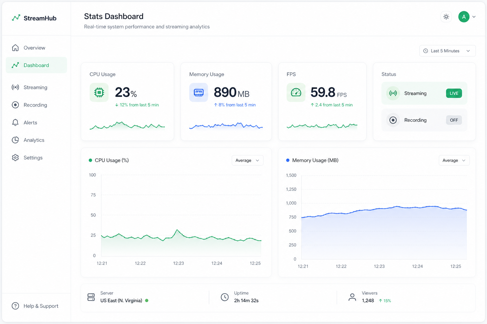

# 性能仪表盘 (Stats Dashboard)

## 一句话

OBS 与会话性能的实时仪表盘 — CPU、FPS、内存、推流/录制状态与趋势图。

## 解决什么问题

- BottomBar 已有 CPU/Mem/Disk 文字，不够直观
- 直播前需要「体检」：FPS 是否稳定、是否丢帧
- 长时间直播需要趋势，不能只看瞬时值

## 核心功能

- [ ] GetStats 轮询 + 卡片展示（CPU、内存、磁盘、FPS、丢帧）
- [ ] 推流 / 录制 / 虚拟 cam / 回放缓冲状态（GetStreamStatus 等）
- [ ] 折线图趋势（最近 5–30 分钟）
- [ ] 阈值告警（FPS < N、CPU > N%）浏览器通知
- [ ] 输出线程 vs 渲染线程丢帧分开显示

## 与现有模块关系

- **BottomBar**：Stats 的「仪表盘化」；可共享轮询逻辑
- **Event Monitor**：StreamStateChanged 等可补充状态变化

## 主要协议依赖

- GetStats、GetStreamStatus、GetRecordStatus、GetVirtualCamStatus
- StreamStateChanged、RecordStateChanged

## 实现复杂度

**低–中** — 数据已有；主要是图表库 + 轮询 composable 抽取。

## 差异化

OBS 自带 stats 在桌面；Web 远程监控面板是补充场景。

## 待决问题

- 图表库选型（Chart.js / ECharts / 轻量 SVG）？
- 历史数据保留多久？
