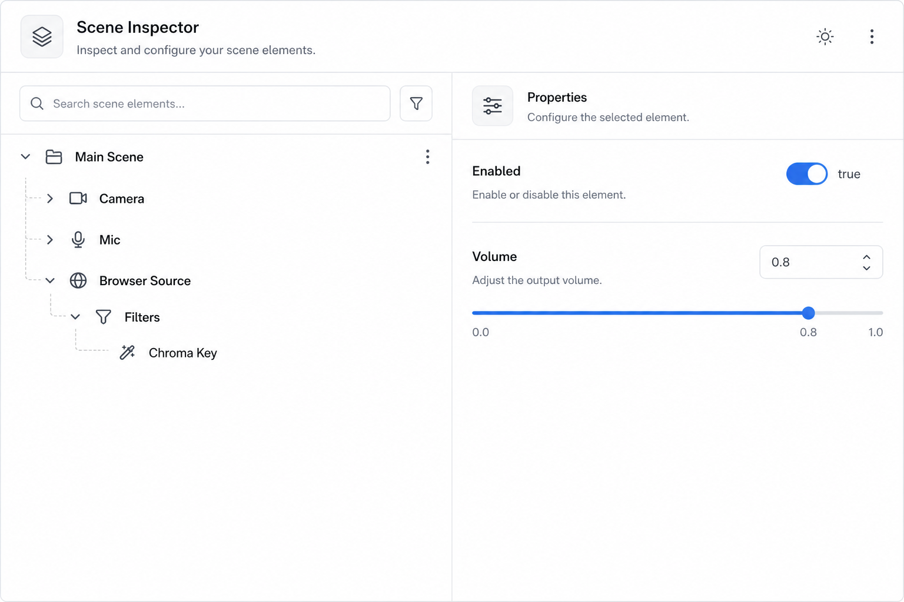

# 场景结构查看器 (Scene Inspector)

## 一句话

以 OBS 真实结构（场景 → 场景项 → 源 → 滤镜）只读展示，便于排查配置问题。

## 解决什么问题

- Debugger 的 API 树是「协议视角」，不是「OBS 结构视角」
- 「为什么这个源没显示 / 没声音」需要看层级关系
- 开发插件时需要快速浏览当前 OBS 状态

## 核心功能

- [ ] 树形结构：Scene → SceneItem → Source → Filter
- [ ] 节点详情面板（settings 摘要、enabled、locked、transform）
- [ ] 刷新 / 懒加载子树
- [ ] 搜索源名 / 场景名
- [ ] 点击节点跳转 Debugger 对应 Request 文档
- [ ] 可选：只读展示 JSON settings

## 与现有模块关系

- **Debugger**：API 参考 vs 实例状态；Inspector 展示「当前 OBS 里有什么」
- **Controller**：可点击 Inspector 节点快速 mute / hide（只读 → 可操作）

## 主要协议依赖

- GetSceneList、GetSceneItemList、GetSceneItemSource
- GetInputSettings、GetSourceFilterList、GetSourceFilter
- GetSceneItemEnabled、GetSceneItemTransform

## 实现复杂度

**中** — 多 Request 组合 + 树 UI；注意 scene collection 切换时刷新。

## 差异化

「OBS 结构浏览器」在 WS 工具里很少见，偏 power user。

## 待决问题

- 是否支持 Group 场景的特殊展示？
- 高频率刷新策略（仅手动 vs 监听 SceneItemCreated 等）？
