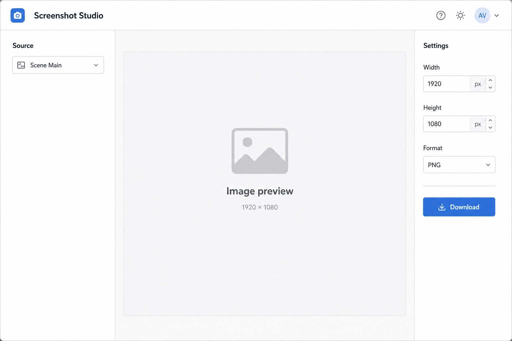

# 截图工作室 (Screenshot Studio)

## 一句话

围绕 GetSourceScreenshot / SaveSourceScreenshot 的专用工具 — 预览、调尺寸、下载。

## 解决什么问题

- Debugger 里截图响应是 base64，查看不便
- 需要批量导出场景/源截图做封面、预告
- 测试 screenshot 参数（imageWidth / imageHeight / format）

## 核心功能

- [ ] 选择源或场景（GetInputList / GetSceneList）
- [ ] 参数：格式、宽高、压缩质量
- [ ] 实时预览
- [ ] 下载 PNG / 复制到剪贴板
- [ ] SaveSourceScreenshot 保存到 OBS 可访问路径
- [ ] 批量：所有场景各截一张

## 与现有模块关系

- **Scene Preview Grid**：共用截图 API，Preview 偏「导播」，Studio 偏「导出」
- **Debugger**：GetSourceScreenshot 的专用 UI

## 主要协议依赖

- GetSourceScreenshot、SaveSourceScreenshot
- GetVersion（supportedImageFormats）

## 实现复杂度

**低** — 表单 + 图片展示；批量模式略增逻辑。

## 差异化

 niche 工具，但对内容创作者有用。

## 待决问题

- 大分辨率截图的性能与内存
- 是否集成到 Scene Preview 而非独立模块？
