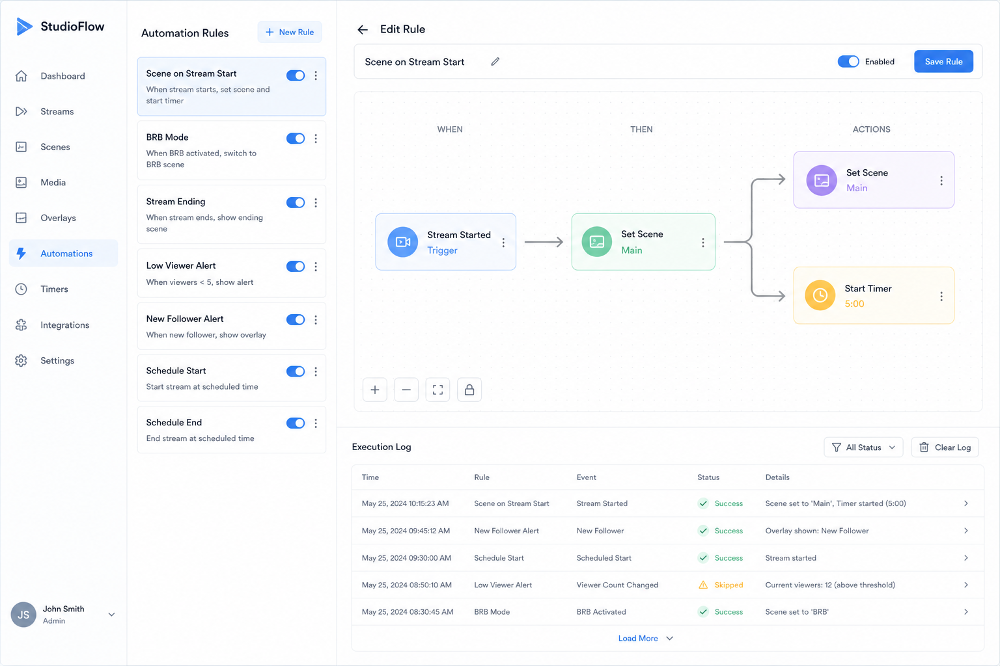

# 自动化编排 (Automation)

## 一句话

When Event / 定时 → Then Request 序列，可视化规则引擎，无需写脚本。

## 解决什么问题

- README 老 TODO：「逻辑操作、定时任务」
- 重复操作（开播自动切场景、断流告警）需要自动化
- 非开发者也想编排 OBS 行为

## 核心功能

- [ ] 规则：触发器 + 条件 + 动作列表
- [ ] 触发器：Event（StreamStateChanged）、定时（cron / interval）、手动
- [ ] 动作：Request 序列（可含 Sleep）
- [ ] 条件：简单表达式（outputActive == true）
- [ ] 规则启用 / 禁用、优先级
- [ ] 执行日志
- [ ] 导入 / 导出规则 JSON

## 与现有模块关系

- **Batch Runner**：一次性手动脚本；Automation 是持久规则
- **Stream Deck**：按钮 = 手动触发；Automation = 自动触发
- **Webhook Bridge**：外部 HTTP 也可作为触发器

## 主要协议依赖

- 全部 Events（订阅）+ 常用 Requests（动作）
- 可选 RequestBatch 执行动作序列

## 实现复杂度

**高** — 规则引擎 + 状态 + 持久化 + 边界情况（scene collection 切换暂停等）。

## 差异化

OBS 原生无 Web 自动化；IFTTT 式 OBS 编排是清晰卖点。

## 待决问题

- 规则引擎 DSL 设计（JSON vs 可视化 flow）
- 浏览器关闭后规则是否失效（纯前端限制）？
