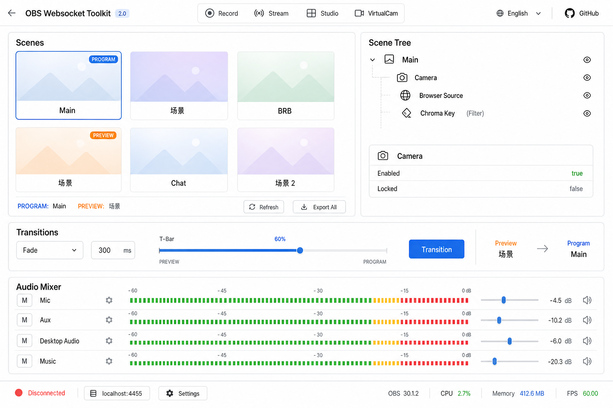

# Controller 2.0 — 导播控制台整合设计

将模块 **#7 音频混音台、#8 场景预览、#9 转场控制、#11 场景结构、#12 截图** 整合进 Controller，形成单一「导播工作面」。

## 设计原则

1. **左看右控**：左侧视觉（预览），右侧结构（Inspector）
2. **下切上听**：下方转场条 + 最底音频混音，符合导播操作顺序
3. **一屏完成**：常见导播动作无需切 Tab
4. **简约风格**：延续 Toolkit 白底、细边框、Inter 字体

## 布局结构

```
┌──────────────────────────────────────────────────────────────────┐
│ ← OBS Toolkit    [●Rec] [●Stream] [Studio] [VCam]     EN  GitHub │  顶栏（已有）
├──────────────────────────────────────────────────────────────────┤
│                                                                  │
│  ┌─ 场景预览 Scenes ─────────────────┐  ┌─ 结构 Scene Tree ──┐ │
│  │ [缩略图] [缩略图] [缩略图]         │  │ ▼ Main (PROGRAM)    │ │
│  │  Main    场景     BRB              │  │   ├ Camera          │ │
│  │ [缩略图] [缩略图]                  │  │   ├ Browser         │ │
│  │  Chat    Starting                 │  │   └ Chroma Key      │ │
│  │                                    │  │ ─────────────────── │ │
│  │ PROGRAM: Main   PREVIEW: 场景      │  │ 节点详情            │ │
│  │ [刷新] [截图全部]                   │  │ enabled · volume    │ │
│  └────────────────────────────────────┘  └─────────────────────┘ │
│                                                                  │
│  ┌─ 转场 Transitions ──────────────────────────────────────────┐ │
│  │ Fade ▼  300ms ────●──────── T-Bar    [Transition] [Cut]    │ │
│  │ Preview: 场景  →  Program: Main                              │ │
│  └──────────────────────────────────────────────────────────────┘ │
│                                                                  │
│  ┌─ 音频 Audio Mixer ──────────────────────────────────────────┐ │
│  │ Mic/Aux    [M] ║████░░░░║ -12dB   Desktop  [M] ║██████░░║   │ │
│  │ Music      [M] ║██░░░░░░║         Browser   [M] ║███░░░░║   │ │
│  └──────────────────────────────────────────────────────────────┘ │
│                                                                  │
├──────────────────────────────────────────────────────────────────┤
│ 🔗 localhost:4455  OBS 32.0  CPU 12%  Mem 512MB                 │  底栏（已有）
└──────────────────────────────────────────────────────────────────┘
```

## 区域说明

### A. 场景预览区（#8 + #12）

| 元素 | 功能 |
|------|------|
| 缩略图网格 | `GetSourceScreenshot` 定时刷新，2–5s 可配置 |
| PROGRAM / PREVIEW 标签 | Studio Mode 下双场景高亮 |
| 单击卡片 | 非 Studio：切 Program；Studio：切 Preview |
| 双击 / Cut 按钮 | Studio Mode 切到 Program |
| 卡片菜单 · 截图 | 单场景 `GetSourceScreenshot` → 下载/复制（#12） |
| 截图全部 | 批量导出所有场景缩略图 |

### B. 场景结构树（#11）

| 元素 | 功能 |
|------|------|
| 树形列表 | Scene → SceneItem → Filter |
| 与预览联动 | 选中树节点，预览区滚动到对应场景 |
| 详情面板 | enabled、locked、transform 摘要 |
| 快捷操作 | 眼睛（显隐）、锁、静音（联动音频区） |

### C. 转场控制条（#9）

| 元素 | 功能 |
|------|------|
| 转场类型下拉 | `SetCurrentSceneTransition` |
| 时长输入 | `SetCurrentSceneTransitionDuration` |
| T-Bar 滑块 | `SetTBarPosition`（仅 Studio Mode 启用） |
| Transition 按钮 | `TriggerStudioModeTransition` |
| Preview → Program 文案 | 当前双场景名 |

非 Studio Mode 时：隐藏 T-Bar，保留转场类型 + 时长。

### D. 音频混音台（#7）

| 元素 | 功能 |
|------|------|
| 横向通道条 | 每路：名称、Mute、推子、电平表 |
| 电平表 | `InputVolumeMeters` 事件（节流 100ms） |
| 推子 | `SetInputVolume` |
| M 按钮 | `ToggleInputMute` |

## 响应式

| 断点 | 调整 |
|------|------|
| ≥1200px | 左 60% 预览 + 右 40% 结构树 |
| 768–1199px | 预览 2 列，结构树折叠为抽屉 |
| <768px | 单列：预览 → 转场 → 音频，结构树进 Tab |

## 与现有 Controller 关系

- **保留**：顶栏 Rec/Stream/Studio/VCam、BottomBar 连接
- **替换**：现有文字场景按钮 → 缩略图网格
- **替换**：简单 Source/Audio 列表 → Inspector 树 + 混音台
- **增强**：Transition 按钮区 → 完整转场条

## 实现分期建议

| 阶段 | 内容 |
|------|------|
| P1 | 预览网格 + 切场景 + BottomBar |
| P2 | Inspector 树 + 详情 |
| P3 | 转场条 + Studio Mode |
| P4 | 音频混音台 + VolumeMeters |
| P5 | 截图导出（单张 + 批量） |

## 效果图


