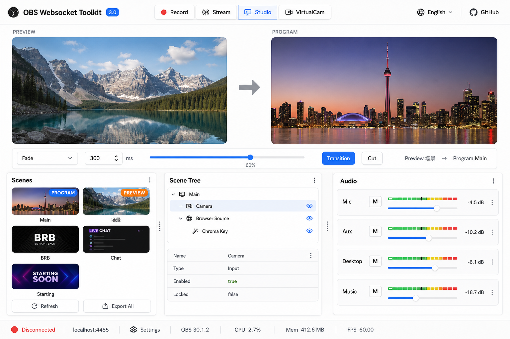

# Controller 3.0 — 导播控制台整合设计（V3）

在 V2 基础上调整布局：**上半 PVW/PGM 大监视器，下半三栏可拖拽分栏**（场景 · 结构树 · 音频）。

整合模块：**#7 音频、#8 场景预览、#9 转场、#11 场景结构、#12 截图**。

## 设计原则

1. **上监下控**：上半专注 PVW/PGM 画面，下半操作场景/结构/音频
2. **三栏可调**：场景、Source Tree、音频默认约 **28% · 44% · 28%**，拖拽分隔条自由调整
3. **音频收窄**：右栏采用**竖向紧凑通道**（Mute + 短推子 + 窄电平），不再占满宽
4. **一屏完成**：常见导播动作无需切 Tab
5. **简约风格**：白底、细边框、圆角监视器（参考用户 PVW/PGM 示意）

## 布局结构

```
┌──────────────────────────────────────────────────────────────────┐
│ ← OBS Toolkit    [●Rec] [●Stream] [Studio] [VCam]     EN  GitHub │  顶栏
├──────────────────────────────────────────────────────────────────┤
│                                                                  │
│   PREVIEW                              PROGRAM                   │
│  ┌─────────────────────┐    →    ┌─────────────────────┐        │
│  │                     │         │                     │        │  上半 ~45%
│  │    PVW 实时画面      │         │    PGM 实时画面      │        │
│  │                     │         │                     │        │
│  └─────────────────────┘         └─────────────────────┘        │
│                                                                  │
│  Fade ▼  300ms  ────●──── T-Bar 60%   [Transition]  [Cut]       │  转场条（窄）
├──────────────────────────────────────────────────────────────────┤
│  Scenes          ║  Scene Tree           ║  Audio                 │
│ ┌────────────┐   ║ ┌─────────────────┐  ║ ┌──────┐              │
│ │[缩][缩][缩]│   ║ │▼ Main           │  ║ │ Mic  │              │
│ │[缩][缩]    │   ║ │  ├ Camera       │  ║ │ Aux  │              │  下半 ~55%
│ │ Main Chat… │   ║ │  └ Browser      │  ║ │ Desk │              │  三栏可拖
│ │[刷新][导出]│   ║ │ 详情: enabled   │  ║ │Music │              │
│ └────────────┘   ║ └─────────────────┘  ║ └──────┘              │
├──────────────────────────────────────────────────────────────────┤
│ 🔗 localhost:4455  OBS 32.0  CPU 12%  Mem 512MB                 │  底栏
└──────────────────────────────────────────────────────────────────┘
         ↑ drag handle (║)  between columns, persisted in localStorage
```

## 区域说明

### A. 监视器区（上半 · #8）

| 元素 | 功能 |
|------|------|
| PVW 监视器 | Studio Mode：`GetSourceScreenshot` / 预览场景实时刷新 |
| PGM 监视器 | 当前 Program 场景实时画面 |
| 中间箭头 | 视觉指示 Preview → Program；可点击触发 Transition |
| 圆角 16:9 | 与用户示意一致，最大高度约 viewport 45% |
| 非 Studio | 仅显示 PGM 全宽；PVW 隐藏或灰显「Studio Mode 关闭」 |

单击 PVW/PGM 区域可弹出该场景截图菜单（#12：下载/复制）。

### B. 转场条（上半与下半之间 · #9）

| 元素 | 功能 |
|------|------|
| 转场类型 + 时长 | 同 V2 |
| T-Bar | Studio Mode 启用 |
| Transition / Cut | `TriggerStudioModeTransition` / Cut |

高度固定 ~48px，不占主视觉。

### C. 场景栏（下左 · #8 + #12）

| 元素 | 功能 |
|------|------|
| 缩略图列表/网格 | 紧凑卡片，当前 Preview/Program 高亮 |
| 单击 | Studio：切 Preview；非 Studio：切 Program |
| 刷新 / 导出全部 | 缩略图与批量截图 |

默认宽度 **~28%**，最小 200px。

### D. 结构树栏（下中 · #11）

| 元素 | 功能 |
|------|------|
| Scene → Item → Filter 树 | 选中当前 Program 或 Preview 场景 |
| 详情区 | enabled、locked、transform 摘要 |
| 快捷操作 | 显隐、锁 |

默认宽度 **~44%**（最宽，便于看层级），最小 240px。

### E. 音频栏（下右 · #7，收窄）

| 元素 | 功能 |
|------|------|
| **竖向紧凑通道** | 每路固定高度 ~56px，非全宽横条 |
| M + 名称 | 左侧 Mute |
| 短推子 + 窄电平 | 横向约 120px，dB 数值 |
| 最多显示 4–6 路 | 超出滚动 |

默认宽度 **~28%**，最小 160px；**禁止拖到过宽**（建议 max 320px）。

## 三栏拖拽

- 组件：`Splitpanes` 或自研 `ResizableColumns`（2 条竖向 handle）
- 持久化：`localStorage` key `controller-v3-pane-sizes`
- 默认值：`[28, 44, 28]`（百分比）
- 拖拽时显示分隔线高亮；双击 handle 恢复默认

## 响应式

| 断点 | 调整 |
|------|------|
| ≥1200px | 完整三栏 + 双监视器 |
| 768–1199px | 监视器缩小；三栏 min 宽度触发横向滚动 |
| <768px | 监视器单列；下半改为 Tab：Scenes / Tree / Audio |

## 与 V2 差异

| V2 | V3 |
|----|-----|
| 预览网格占左上大块 | PVW/PGM 大监视器占上半 |
| 结构树占右上 | 结构树移至下中栏 |
| 音频全宽横条 | 音频收窄为右栏竖向通道 |
| 固定左右比例 | 三栏可拖拽 |

## 实现分期

| 阶段 | 内容 |
|------|------|
| P1 | 布局骨架 + Splitpanes + PVW/PGM 占位 |
| P2 | 场景栏缩略图 + 切场景 |
| P3 | Scene Tree + 详情 |
| P4 | 转场条 + Studio Mode |
| P5 | 音频竖栏 + VolumeMeters |
| P6 | 截图导出 |

## 效果图


